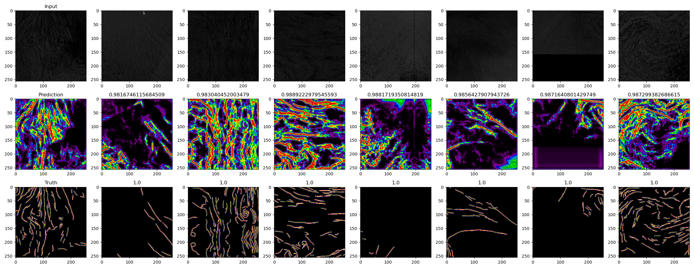
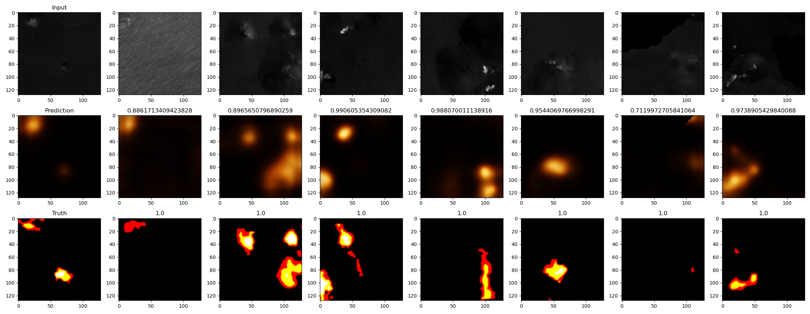
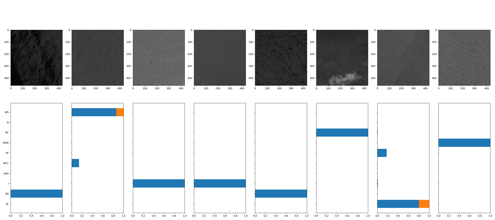
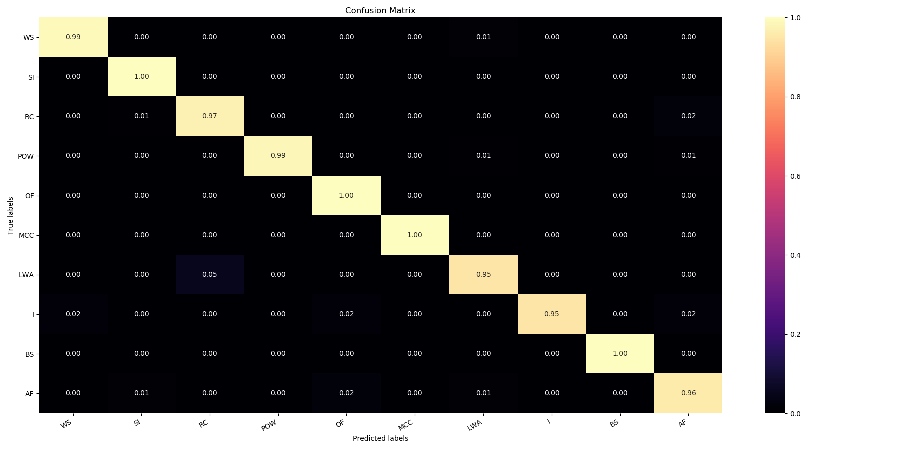
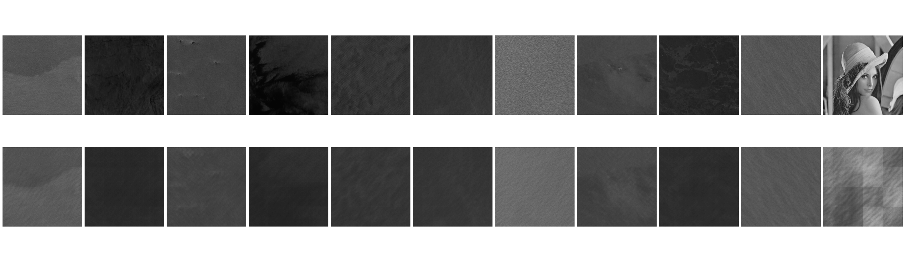

# DeepLearning

This repository contains some piece of code to train models. The outputs are usually the .h5 and a .json containing the config & the history of the training.

## Requirements

- tensorflow==2.6
- scikit-image=0.16.2
- numpy==1.19.5
- PIL==1.1.17

## What's inside this repo ?

### Segmenter

###### Inputs

````shell
>>> python train.py segmenter 20210611T001000 --INPUT_SHAPE=(256,256,1) --NAME=20210611T001000/3 --batch_size=4 --training_steps=476 --validation_steps=117 --OUTPUT_SHAPE=(256,256,1) --LOSS=WBCE --LAST_ACTIVATION=sigmoid --CONV_LAYERS=(32,64,128) --epochs=100 --CACHE=True --RESNET=True
>>> python train.py segmenter NEXRAD/SV-2 --INPUT_SHAPE=(128,128,1) --NAME=NEXRAD_FINAL/SV-2_128_05 --batch_size=32 --training_steps=380 --validation_steps=23 --OUTPUT_SHAPE=(128,128,3) --LOSS=NEXRAD_MSE --LAST_ACTIVATION=sigmoid --CONV_LAYERS=(32,64,128) --epochs=50 --CACHE=True
>>> python train.py segmenter TenGeoP/segmentation/manual --INPUT_SHAPE=(256,256,1) --NAME=TenGeoP/segmenter/manual/v2.2/unet256.64.9 --batch_size=32 --training_steps=512 --OUTPUT_SHAPE=(64,64,10) --LOSS=WBCE --LAST_ACTIVATION=softmax --CONV_LAYERS=(32,64,128,256) --epochs=50 --CACHE=True --CLASS_WEIGHTS=(38.71,11.71,233.75,14.01,8.19,70.87,2.34,50.2,9.15,8.25)
````

###### Example

Segmentation has a single output channel:


Segmentation has three/four output channels (assumed to be RGB/RBGA) :


Segmentation has more than four output channels:


### Categorizer

###### Inputs

````shell
>>> python train.py inceptionV3 TenGeoP/categorization/wv --INPUT_SHAPE=(463,431,1) --NAME=TenGeoP/categorizer/wv --batch_size=16 --training_steps=100 --validation_steps=100 --LOSS=categorical_crossentropy --LAST_ACTIVATION=softmax --epochs=100 --CACHE=False --iterations=10
````

###### Example





#### Yes U-GAN

Yes U-GAN is a project of U-Net model augmented by a secondary GAN loss.





## Dataset location

Since we use multiprocessing, and by doing so multiple simultaneous file access, the datasets have to be put on a SSD.

The folders should follow these architectures :


### For segmentation :
```
{dataset_name}
|-- train
|   |-- input
|   |   |-- {file1.png}
|   |   |-- {file2.png}
|   |   `-- ...
|   `-- output
|       |-- {file1.png}
|       |-- {file2.png}
|       `-- ...
`-- val
    |-- input
    |   |-- {file1.png}
    |   |-- {file2.png}
    |   `-- ...
    `-- output
        |-- {file1.png}
        |-- {file2.png}
        `-- ...
```   

### For categorization
```
{dataset_name}
|-- train
|   |-- {label_1}
|   |   |-- {file1.png}
|   |   |-- {file2.png}
|   |   `-- ...
|   `-- {label_2}
|   |   |-- {file1.png}
|   |   |-- {file2.png}
|   |   `-- ...
|   `-- ...
`-- val
    |-- {label_1}
    |   |-- {file1.png}
    |   |-- {file2.png}
    |   `-- ...
    |-- {label_2}
    |   |-- {file1.png}
    |   |-- {file2.png}
    |   `-- ...
    `-- ...
```

### For autoencoding :
```
{dataset_name}
|-- train
|   |-- {file1.png}
|   |-- {file2.png}
|   `-- ...
`-- val
    |-- {file1.png}
    |-- {file2.png}
    `-- ...
```   

Files are either .png or .npy.