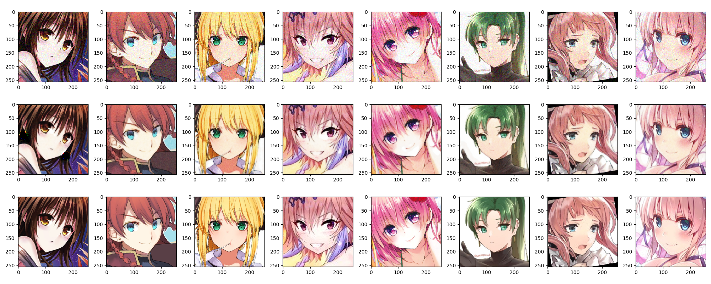
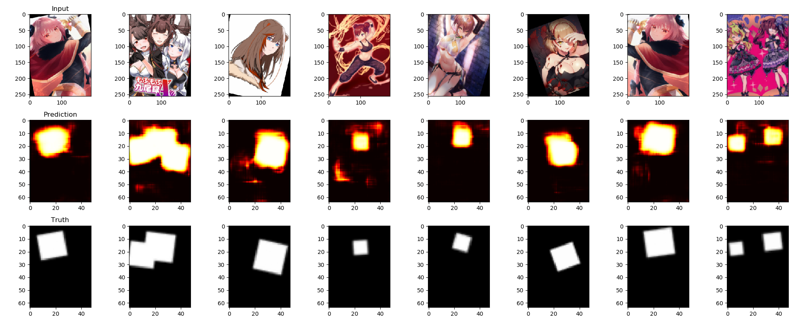
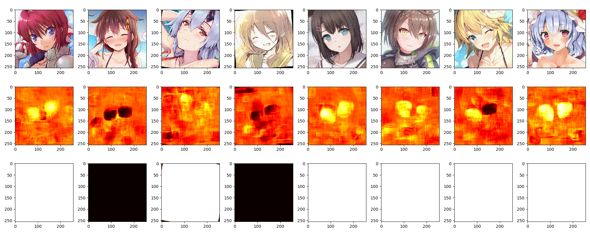
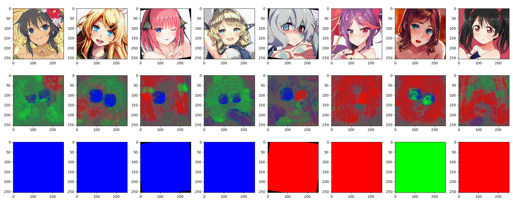
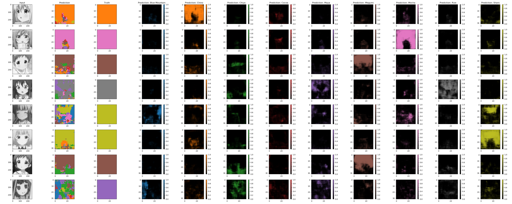
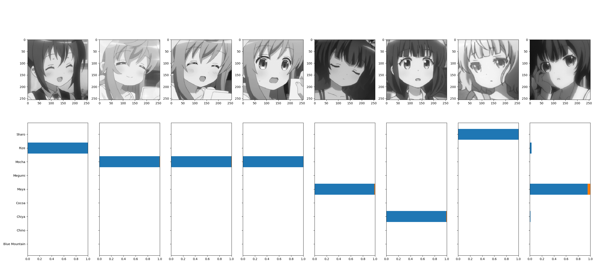
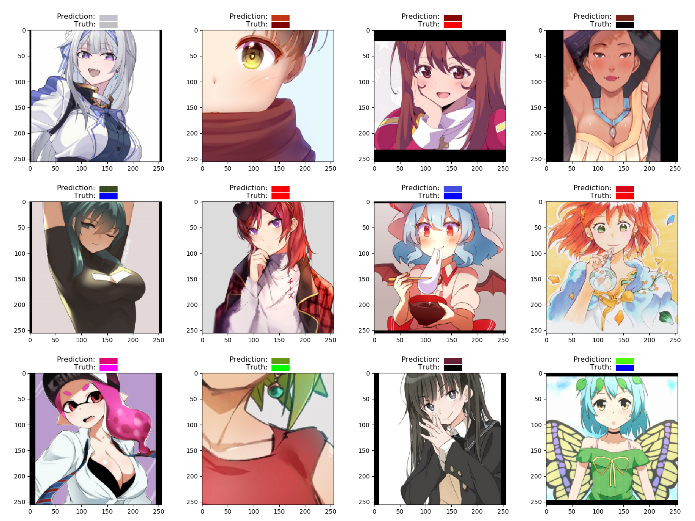

# DeepLearning

## Requirements

- tensorflow-gpu==1.14.0
- Keras==2.2.4
- keras-contrib==2.0.8
- scikit-image=0.16.2

## What's inside this repo ?
### Autoencoders

###### Inputs

````shell
>>> python train.py autoencoder anime/fav-rignak --name="anime/autoencoder/fav-rignak" --INPUT_SHAPE=(256,256,3) --OUTPUT_SHAPE=(256,256,3)
````

###### Example



### Segmenter

###### Inputs

````shell
>>> python train.py segmenter anime\face\faces_segmentation --name="anime/segmenter/faces/256-192/64-48" --INPUT_SHAPE=(256,192,3) --OUTPUT_SHAPE=(64,48,3) --LOSS=WBCE --LAST_ACTIVATION=sigmoid --CONV_LAYERS="(32, 64, 128)" 
````

###### Example




### Saliency

Knowing only a classification of the training set, we try to draw the segmentation.

###### Inputs

````shell
>>> python train.py saliency anime/open_eyes/open_eyes  --INPUT_SHAPE="(256,256,3)" --NAME=saliency/open_eyes --OUTPUT_SHAPE="(256,256,1)" --LOSS=binary_crossentropy --training_steps=512 --validation_steps=128 --CONV_LAYERS="(32, 64, 128)"
>>> python train.py saliency anime/eye_color  --INPUT_SHAPE="(256,256,3)" --NAME=saliency/eye_color --OUTPUT_SHAPE="(256,256,3)" --CONV_LAYERS="(32, 64, 128)"
>>> python train.py saliency anime/GochiUsaV2  --INPUT_SHAPE="(256,256,1)" --NAME=saliency/GochiUsaV2 --OUTPUT_SHAPE="(32,32,10)" --CONV_LAYERS="(32, 64, 128)"
````

###### Example








### Categorization on images

###### Inputs

````shell
>>> python train.py inceptionV3 anime/GochiUsaV2 --NAME=GochiUsaV2 --LOSS=crossentropy --INPUT_SHAPE="(256,256,1)"
````


###### Example



.png)

## Dataset location

Since we use multiprocessing, and by doing so multiple simultaneous file access, the datasets have to be put on a SSD.

The folders should follow these architectures :

### Regression

###### Inputs

````shell
>>> python train.py regressor anime/hair_color --INPUT_SHAPE="(256, 256, 3)" --NAME="anime/regressor/hair_color" --ATTRIBUTES="(R, G, B)" --epochs=50 --CACHE=True
````

###### Example

If the attributes to regress are R, G and B, we consider the output to be a color and plot the results like this :




### For autoencoders :
```
{dataset_name}
|-- train
|   |-- {file1.png}
|   |-- {file2.png}
|   `-- ...
`-- val
    |-- {file1.png}
    |-- {file2.png}
    `-- ...
```   
        
### For segmenter :
```
{dataset_name}
|-- train
|   |-- input
|   |   |-- {file1.png}
|   |   |-- {file2.png}
|   |   `-- ...
|   `-- output
|       |-- {file1.png}
|       |-- {file2.png}
|       `-- ...
`-- val
    |-- input
    |   |-- {file1.png}
    |   |-- {file2.png}
    |   `-- ...
    `-- output
        |-- {file1.png}
        |-- {file2.png}
        `-- ...
```   

### For categorizer & saliency
```
{dataset_name}
|-- train
|   |-- {label_1}
|   |   |-- {file1.png}
|   |   |-- {file2.png}
|   |   `-- ...
|   `-- {label_2}
|   |   |-- {file1.png}
|   |   |-- {file2.png}
|   |   `-- ...
|   `-- ...
`-- val
    |-- {label_1}
    |   |-- {file1.png}
    |   |-- {file2.png}
    |   `-- ...
    |-- {label_2}
    |   |-- {file1.png}
    |   |-- {file2.png}
    |   `-- ...
    `-- ...
```   

### For regression
```
{dataset_name}
|-- train
|   |-- {file1.png}
|   |-- {file2.png}
|   `-- ...
`-- val
|   |-- {file3.png}
|   |-- {file4.png}
|   `-- ...
`-- output.json
```   

In this case, the json is :
```json
{
    "{file1.png}": {
        "{attribute1}": 1,
        "{attribute2}": 2
    },
    "{file2.png}": {
        "{attribute1}": 3,
        "{attribute2}": 4
    }
}
```   
Please note that this means that filenames should be unique accross the *val* and *train* folders.


