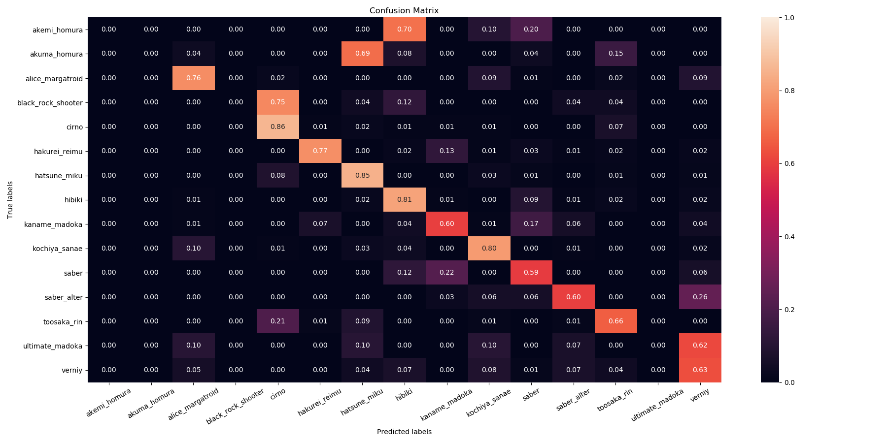
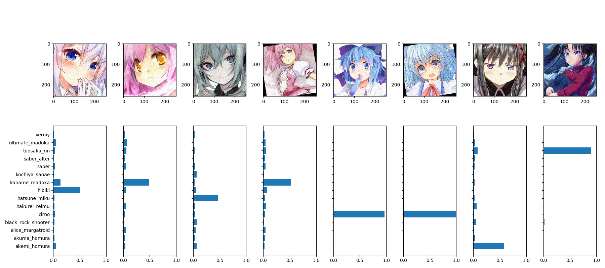
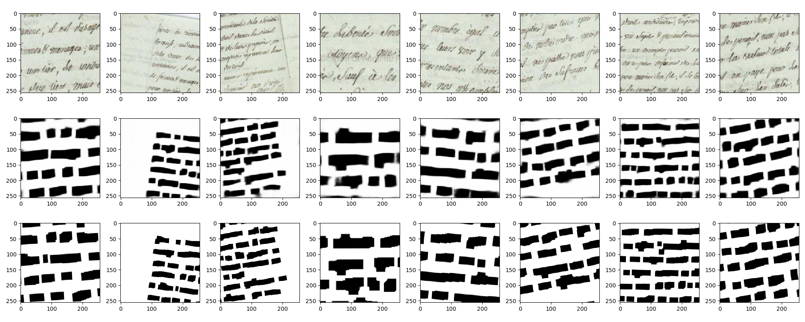
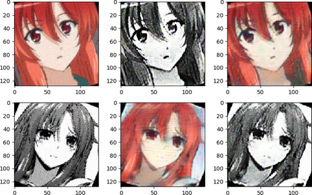
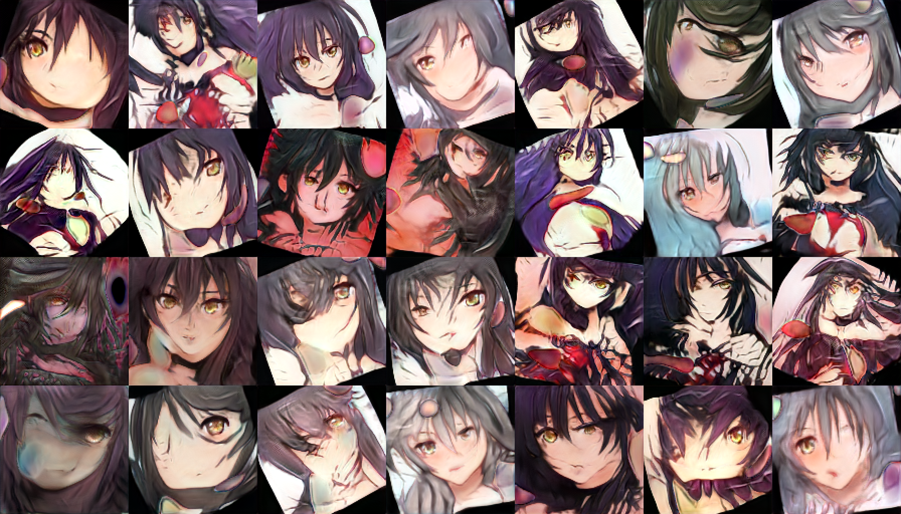
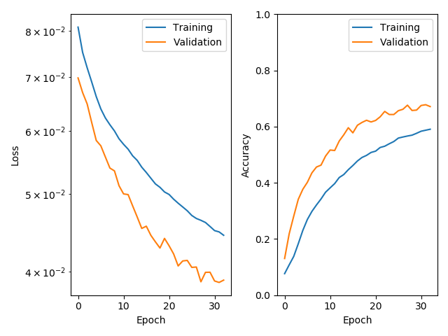

# DeepLearning

- [Requirements](#requirements)
- [Use](#use)
  - Image2Image
      - [Autoencoders](#autoencoders)
      - [Saliency](#saliency)
  - Categorization
      - [Categorizer (image2tag)](#categorization-on-images)
      - [Speech Recognition (sound2tag)](#speech-recognition-specifics)
  - [Optical Character Recognition](#optical-character-recognition)
  - [Reinforcement Learning](#reinforcement-learning)
  - GANs
      - [CycleGan](#cyclegan)
      - [StyleGan](#stylegan)
  - Legacy
      - [Hierarchical Categorizer](#hierarchical-categorizer)
- [Dataset location](#dataset-location)
- [Callbacks](#callbacks)
    - [callbacks.HistoryCallback](#callbackshistorycallback)
    - [callbacks.AutoencoderExampleCallback](#callbacksautoencoderexamplecallback)
    - [callbacks.ClassificationExampleCallback](#callbacksclassificationexamplecallback)
    - [callbacks.ConfusionCallback](#callbacksconfusioncallback)

## Requirements

- os
- sys
- glob
- tqdm
- numpy
- cv2
- scipy
- PIL
- datetime
- fire
- matplotlib
- seaborn
- tensorflow
- keras
- Rignak_Misc

###### Reinforcement learning specifics

- pygame
- skimage
- Rignak_Games

###### Speech recognition specifics

- sounddevice

###### StyleGan specififics

- argparse
- six
- threading
- traceback
- typing
- pprint
- json
- times
- types
- enum
- copy
- io
- pathlib
- pickle
- platform
- re
- shutil
- zipfile
- collections
- tensorboard
- inspect
- uuid


## Use

Autoencoders and categorizer revolve around the *train.py*

````shell
>>> python train.py --help
NAME
    train.py - Train a network

SYNOPSIS
    train.py TASK DATASET <flags>
    
DESCRIPTION
    Train a network
    
POSITIONAL ARGUMENTS
    TASK
        the type of neural network, either "autoencoder", "saliency", "mnist", "categorizer", "style_transfer" or "speech_categorization"
    DATASET
        name of the folder containing the images

FLAGS
    --batch_size=BATCH_SIZE
        size of each batch
````


### Autoencoders

###### Inputs

````shell
>>> python train.py autoencoder fav-rignak
````

###### Outputs

- **_outputs\summary\fav-rignak.txt**, the summary of the neuron network ;
- **_outputs\models\fav-rignak.h5**, the pickled model ;
- **_outputs\history\fav-rignak.png**, the evolution of the loss during the training on both training and validation sets ;
- **_outputs\example\fav-rignak_current.png**, sample input/output/groundtruth of the model during the training on the validation set.

###### Example (NYA)


### Saliency

Knowing only a classification of the training set, we try to draw the segmentation.

###### Inputs

````shell
>>> python train.py saliency open_eye
````

Supports dataset with two and three class.

###### Outputs

- **_outputs\summary\open_eyes.txt**, the summary of the neuron network ;
- **_outputs\models\open_eyes.h5**, the pickled model ;
- **_outputs\history\open_eyes.png**, the evolution of the loss during the training on both training and validation sets ;
- **_outputs\example\open_eyes_current.png**, sample input/output/groundtruth of the model during the training on the validation set.

###### Example


### Categorization on images

###### Inputs

````shell
>>> python train.py categorizer waifu
````

###### Outputs

- **_outputs\summary\waifu.txt**, the summary of the neuron network ;
- **_outputs\models\waifu.h5**, the pickled model ;
- **_outputs\history\waifu.png**, the evolution of the loss during the training on both training and validation sets ;
- **_outputs\confusion\waifu.png**, confusion of the model during the training on the validation set.


###### Example





### Categorization on sound

Using the spectrogram of the sound, we convert the .wav into .png. Thus, we can apply the classic computer vision methods.

###### Dataset examples

- 経済


- 消しゴム


The images will then be categorized as a classical single label problem.

### Optical Character Recognition

First we train a segmenter to get thumbnails of each word.

````shell
>>> python train.py style_transfer text_segmentation
````



Then, we apply the segmentation:

```
> python OCR/apply_segmentation.py --help
NAME
    apply_segmentation.py - Use a trained segmentation model to create the thumbnail of each segmented element.
    
SYNOPSIS
    apply_segmentation.py MODEL_FILENAME <flags>
    
DESCRIPTION
    Use a trained segmentation model to create the thumbnail of each segmented element.
    
POSITIONAL ARGUMENTS
    MODEL_FILENAME
        name of the file containing a model trained for the segmentation
        
FLAGS
    --input_folder=INPUT_FOLDER
        folder containing the images to segment
    --output_folder=OUTPUT_FOLDER
        folder which will contain the thumbnails
```


    >>> python OCR/apply_segmentation.py _outputs/models/text_segmentation.h5
    


Then we train a categorizer. Due to lack of data, we try to use MNIST

````shell
>>> python train.py categorizer mnist
````


The we apply the model to the thumbnails :

````shell
````


### Reinforcement learning

###### Inputs

````shell
>>> cd ReinforcementLearning
>>> python Launcher.py Asteroid 
````

###### Outputs


### CycleGan

Cloned from https://github.com/eriklindernoren/Keras-GAN/tree/master/cyclegan

###### Inputs

````shell
>>> cd CycleGan
>>> python cyclegan.py
````

###### Outputs



### StyleGan

Cloned from https://github.com/NVlabs/stylegan

###### Inputs

````shell
>>> cd StyleGan
>>> python train.py
````

Once a model is trained, we can generate pictures with :

````shell
>>> python run.py --help
NAME
    run.py - Create images from a given model
SYNOPSIS
    run.py <flags>
DESCRIPTION
    Create images from a given model
FLAGS
    --model_filename=MODEL_FILENAME
        name of the model to use
    --truncation_psi=TRUNCATION_PSI
        originality factor, close to 0 means less originality
    --result_root=RESULT_ROOT
        name of the folder to contain the output
    --number_of_pictures=NUMBER_OF_PICTURES
        number of picture to generate
````

We can also do interpolation videos (ffmpeg must be installed) :

````shell
>>> python video.py --help
NAME
    video.py - Create an interpolation video
    
SYNOPSIS
    video.py <flags>
    
DESCRIPTION
    Create an interpolation video
    
FLAGS
    --model_filename=MODEL_FILENAME
        name of the file containing the models
    --truncation_psi=TRUNCATION_PSI
        originality factor, closer to 0 means less original
    --result_root=RESULT_ROOT
        name of the folder to contains the output
    --duration=DURATION
        length, in seconds, of the video to create
    --grid_dim=GRID_DIM
        number of thumbnails on each row and columns of the video
    --fps=FPS
        frame per seconds
    --image_zoom=IMAGE_ZOOM
        zoom applied on the output
````

###### Outputs

Groundtruth :


Results :


That's what happen when we train a StyleGan with not enough of a GPU.

## Hierarchical Categorizer

This program is heavily outdated (being one of the survivors of the massive refactoring done in September 2019).

The idea is to regroup labels in classes. We first classify on class (example: black_clothes/red_clothes) then on labels (example: Batman/Black Panther, Iron Man/Spyder Man).

The concept is described in length in the following [here](Categorizer/Legacy_HierarchicalCategorizer.pdf)

## Dataset location

Since we use multiprocessing, and by doing so multiple simultaneous file access, the datasets have to be put on a SSD.

The folders should be like :
- autoencoder
    - _{dataset_name}_
        - train
        - val
- categorizer
    - _{dataset_name}_ 
        -  train
            - _{label_1}_
            - _{label_2}_
            - ...
        - val
            - _{label_1}_
            - _{label_2}_
            - ...
- cyclegan
    - _{dataset_name}_
        - trainA
        - trainB
        - valA
        - valB
- style_transfer
    - _{dataset_name}_
        - train
            - input
            - output
        - val
            - input
            - output
- stylegan
    * _{dataset_name}_


## Callbacks

If there is one thing useful in this repository, it's the callbacks. There are create at the end of each epochs and give information about the running training.

###### callbacks.HistoryCallback



###### callbacks.AutoencoderExampleCallback


###### callbacks.ClassificationExampleCallback


###### callbacks.ConfusionCallback

